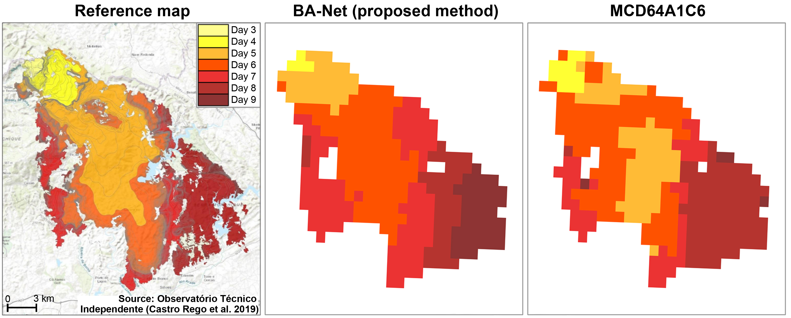

# BA-Net: A deep learning approach for mapping and dating burned areas using temporal sequences of satellite images

Article available online at [ISPRS Journal of Photogrammetry and Remote Sensing](https://www.sciencedirect.com/science/article/pii/S0924271619303089?dgcid=author).

## How to use 
* Install [Anaconda](https://www.anaconda.com/distribution/) Python 3.6+ 
* Install fastai and pytorch:
```bash
conda install pytorch=1.1
conda install -c fastai fastai=1.0.50.post1
```

* Clone this repository:
```bash
git clone https://github.com/mnpinto/banet.git
```

## Dataset
The dataset used to train the model and the pretrained weights are available at https://drive.google.com/drive/folders/1142CCdtyekXHc60gtIgmIYzHdv8lMHqN?usp=sharing. Notice that the size of the full dataset is about 160 GB. You can, however, donwload individual regions in case you want to test with a smaller dataset.

## Generate predictions for a new region in 5 steps
The procedure to generate predictions for a new region or for a different period of the existing regions is straightforward.

* **Step 1.** Define a `.json` file with region name, bounding boxes and spatial resolution. Region definition files are by default on `data/regions` and should be named as `R_{name}.json`, where name is the name you give to the region inside the file.
For example for Iberian Peninsula region the file `data/regions/R_PI.json` contains the following: `{"name": "PI", "bbox": [-10, 36, 5, 44], "pixel_size": 0.01}`. (The code is only tested with pixel_size of 0.01.)

* **Step 2.** To download the reflectance data a utility script is provided, `run/ladsweb.bash`, however in order to use it you need to first register on the website and generate an authentication code. You will also need for this script a python2 environment with `SOAPpy` library. All remaining code work with python3. Once you are set, you can run `ladsweb.bash` and the files will be requested and downloaded. Depending on the size of the request and the server availability this may take a while and notice that there is a limit for the number of files in each request.

* **Step 3.** Next you need to download the VIIRS active fire data for the region you seletected. This procedure is manual but you should be able to request data for the entire temporal window in one go. To do that go to https://firms.modaps.eosdis.nasa.gov/download/, select `Create New Request`, select the region based on your region bounding box, for fire data source select `VIIRS`, then select the date range and finally `.csv` for the file format. You should receive an email with the confirmation and later another with the link to download the data. If not go back to the download page enter the email you used for the request and choose `Check Request Status`. If it is completed the download link will appear. Once you have the file place it in `data/hotspots` and name it `hotspots{name}.csv` where name is the name of the region as in the `.json` file defined in Step 1.

* **Step 4.** Now that you have all the data, you can run the utility script `run/proc_dataset.bash` making sure to check the paths are correct in the begining of the file. By default the data will be processed for the entire temporal window found.

* **Step 5.** Finally you just need to run `run/predict_monthly.bash` to get the model outputs saved at `data/monthly/{name}/`. 

## Train the model from scratch
To train the model you need a dataset of image tiles and the respective targets. The data for the 5 study regions is available for download at https://drive.google.com/drive/folders/1142CCdtyekXHc60gtIgmIYzHdv8lMHqN?usp=sharing. In case you want to train a model on different regions the procedure to collect VIIRS data is described on **Generate predictions for a new region in 5 steps** above. 

* **Step 0.** In case you opted for new regions you need to collect MCD64A1 collection 6 burned areas to use as targets. MCD64A1 collection 6 data can be downloaded from `ftp://ba1.geog.umd.edu/` server (description and credentials available on http://modis-fire.umd.edu/files/MODIS_C6_BA_User_Guide_1.2.pdf section 4). Once you log into the server go to `Collection 6/TIFF` folder and download data for the window or windows covering your region (Figure 2 on the user guide shows the delineation of the windows).

* **Step 1.** Once you have the data you need to generate the dataset by runing `run/proc_dataset.bash` and then create the image tiles sequences for train and validation by running `run/create_tiles_dataset.bash`. If you downloaded the dataset already in `.mat` files format provided in the url above then you just run `run/create_tiles_dataset.bash` for each region to generate the tiles.

* **Step 2.** To train the model then you just need to run `train.bash`. To use sequences of 64 days with 128x128 size tiles and batch size of 1, you need a 8 GB GPU. You can try reducing the sequence length if your GPU has less memory or increase the batch size otherwise.

* **Step 3.** After training the models you can generate the burned area maps by running `run/predict_monthly.bash` for each region and year. **You need to edit `run/predict_monthly.py` to update the weight files list to the ones you generated.** 

## Fine-tune the model for a specific region or for other data source (transfer learning)
It is possible to fine-tune the trained model weights to a specific region or using a different source for the input data (e.g., data from VIIRS 375m bands or data from another satellite). The easiest way to include a new dataset is to write a `Dataset` class similar to `Viirs750Dataset` or the other dataset classes on `scripts/datasets`. Once you have the new dataset you can follow the **Train the model from scratch** guideline and the only change you need to make is to make sure you load the pretrained weights before starting to train.

## Troubleshooting
If you find any bug or have any question regarding the code or applications of BA-Net you can navigate to `Issues` tab and create a new Issue describing your problem. I will try to answer as soon as possible.
